# 🤖 JWA RoboForce – WRO 2026 Sumo Robot

**Jeddah World Academy**  
**WRO 2026 – Sumo Robot**  
**Team No. 5902**

---

## 👥 Team | الفريق

**Team Name:** JWA RoboForce  
**School:** Jeddah World Academy  
**Students:** Ghazl Bakhsh & Layan Baroom  
**Coach:** Samah AbuAbsah  

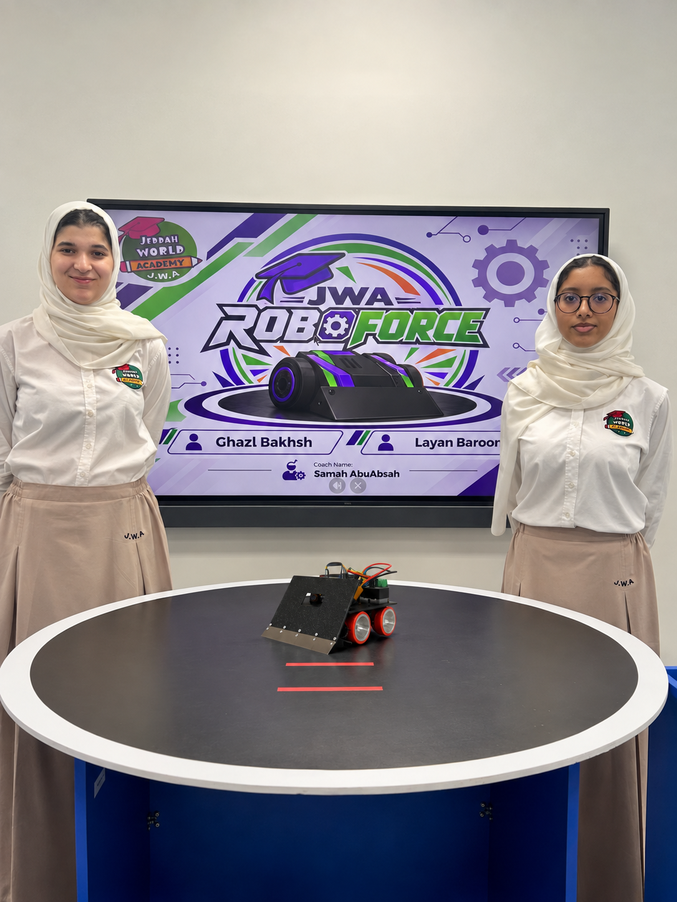

### Team Members

**Ghazl Bakhsh**

Ghazl is a Grade 11 student at Jeddah World Academy. She enjoys challenges and trying different ideas in robotics. Her main role was developing the Sumo strategies, including searching for the opponent, choosing the attack method, and avoiding the ring edge. She worked with Layan, with their coach’s guidance, on building, programming, testing, and improving the robot after each trial.

**Layan Baroom**

Layan is a Grade 11 (A) student at Jeddah World Academy. Her hobbies include drawing, writing poetry and stories in English, and photography. She enjoys design and working on details. Her role included helping design the robot, arranging its components to suit the movement and sensors, and working with Ghazl and their coach on building, programming, testing, and improving the robot.

---

## 🎯 Project Overview

JWA RoboForce designed and developed an autonomous Sumo Robot for the **WRO 2026 Sumo Robot Competition**.

The project included:

- Engineering and mechanical design
- Fusion 360 CAD design
- Arduino programming
- Motor and movement control
- Opponent detection
- Edge detection and fall prevention
- Sumo attack and search strategies
- Testing and performance improvement
- 3D printing
- Heritage-inspired exterior design
- Video documentation

The robot was developed through repeated testing and improvement to achieve reliable movement, opponent detection, pushing performance, and edge avoidance.

---

## 📏 Robot Specifications

The robot was designed according to the competition requirements and the WRO Sumo guidelines followed by the team.

| Specification | Robot |
|---|---|
| Maximum Dimensions | 20 × 20 cm |
| Maximum Weight | 2.5 kg |
| Control | Fully Autonomous |
| Controller | Arduino Nano |
| Movement | 4 DC Geared Motors |
| Edge Sensors | 2 × TCRT5000 |
| Opponent Sensors | 5 × E18-D80NK |
| Battery | LiPo 3S – 11.1V – 2200mAh – 50C |
| Programming | Arduino IDE / C++ |
| Start System | Physical Start Button |
| Start Delay | 5 Seconds |
| Main Strategy | Search, Detect, Attack, Push & Edge Avoidance |

The engineering design, programming, sensor placement, and competition strategy were developed while following the competition guidelines, including the robot size and weight limits, autonomous operation, and the required 5-second delay after activation.

---

## ⚙️ Main Components

The robot combines mechanical, electronic, sensing, and power components into one autonomous system.

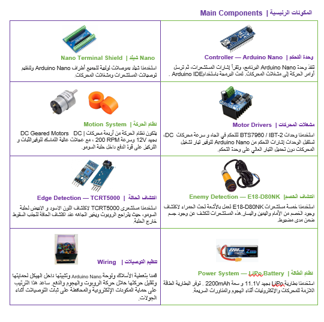

### Controller

The robot uses an **Arduino Nano** as its main controller.

A **Nano Terminal Shield** helps organize the electrical connections and makes the wiring easier to access during testing and maintenance.

### Motion System

The robot uses **four DC geared motors** and high-traction wheels.

The movement system allows the robot to:

- Move forward
- Move backward
- Turn left
- Turn right
- Search for the opponent
- Attack and continuously push the opponent
- Move away from the ring edge

### Motor Drivers

Motor drivers are used to control the DC motors and provide the current required for robot movement and pushing.

### Power System

The robot uses a:

**LiPo 3S – 11.1V – 2200mAh – 50C battery**

The battery provides the power required by the motors and electronic system during movement, searching, and pushing.

---

## 🔌 Electronics & Wiring

The electronic components were arranged inside the robot to keep the system organized and accessible during development.

The wiring and Arduino connections were covered and protected to help keep them secure during competition rounds and reduce unwanted movement of wires while the robot is operating.

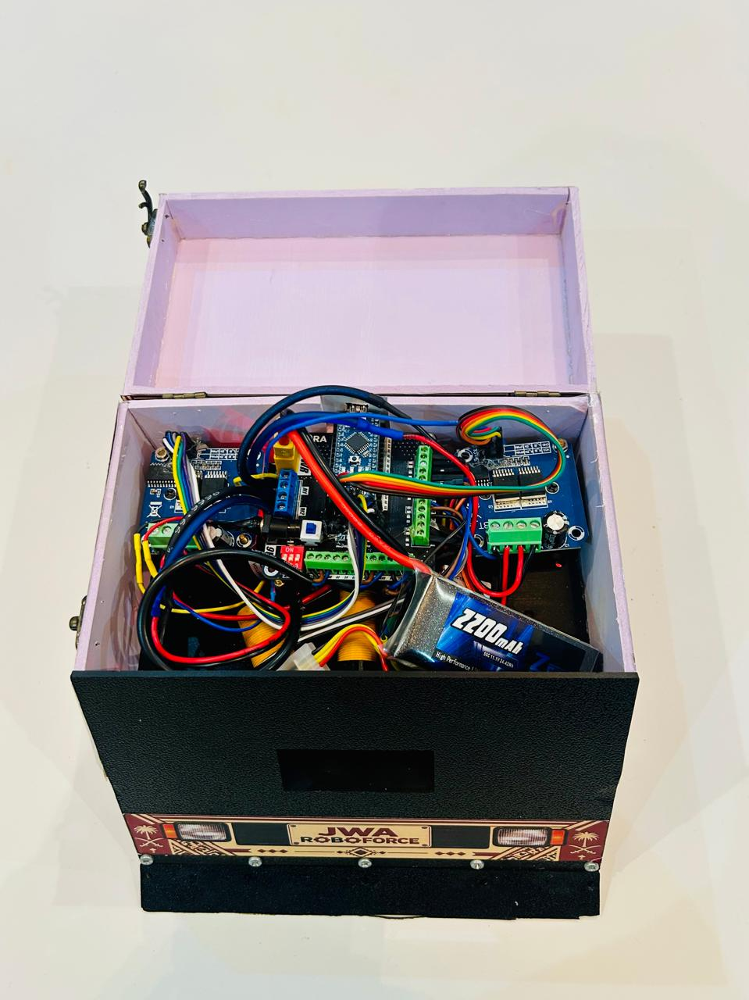

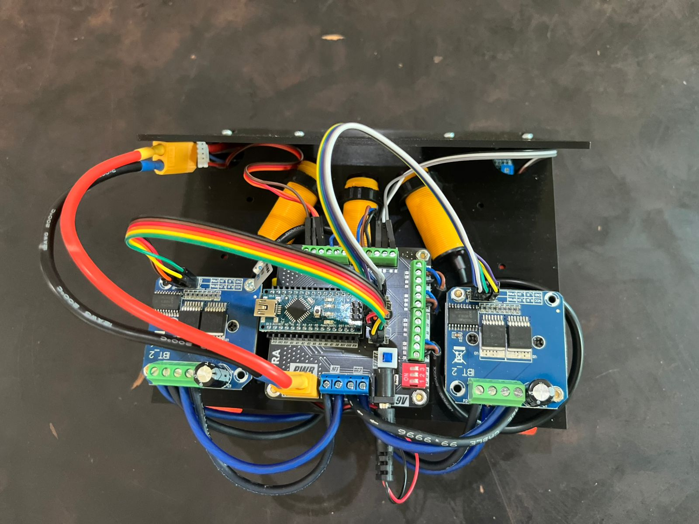

---

## 👁️ Sensor System

The robot uses two main types of sensors for opponent detection and edge avoidance.

### TCRT5000 – Edge Detection

Two **TCRT5000** sensors are used to detect the white boundary of the Sumo ring.

During our tests:

- **Black ring surface = HIGH / 1**
- **White edge = LOW / 0**

When the white edge is detected, edge avoidance receives priority. The robot moves backward away from the boundary before returning to its opponent-searching strategy.

### E18-D80NK – Opponent Detection

Five **E18-D80NK** infrared proximity sensors are used to detect the opponent from different directions.

During our tests:

- **No opponent detected = HIGH / 1**
- **Opponent detected = LOW / 0**

The sensors allow the robot to determine the direction of the opponent and respond by turning toward it or attacking.

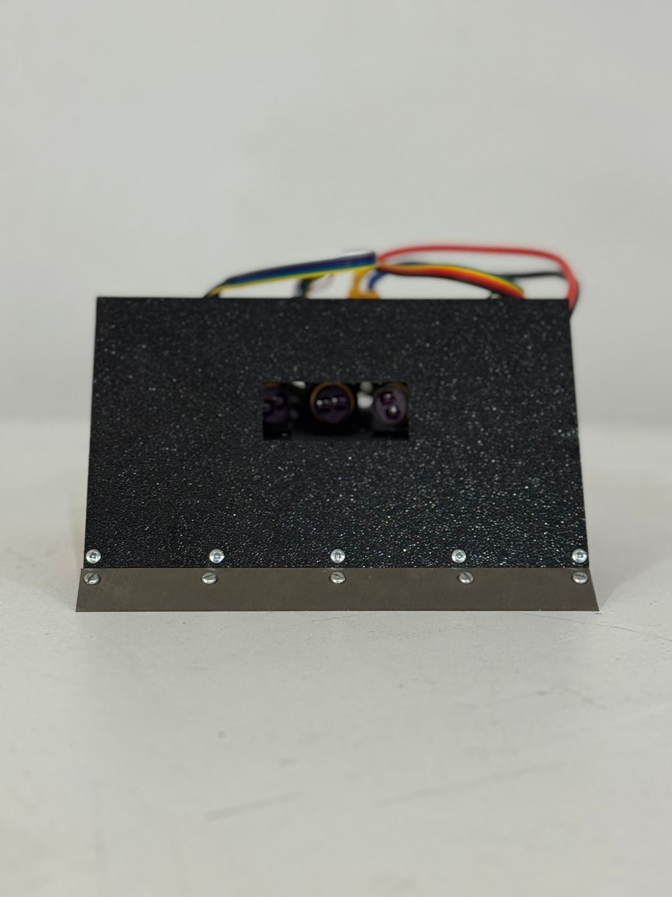

---

## 💻 Arduino Programming

The robot was programmed using **Arduino IDE / C++**.

The complete Arduino program is available directly in this repository:

### [`RoboSumo_code.ino`](RoboSumo_code.ino)

The program integrates:

- Physical start button
- Required 5-second start delay
- Motor speed control using PWM
- Opponent detection
- Multi-directional searching
- Front attack
- Continuous pushing
- Left and right turning
- Edge detection
- Edge avoidance
- Return to search behavior

---

## 🧠 Programming & Sumo Strategy

Our strategy was developed and improved through repeated testing inside the Sumo ring.

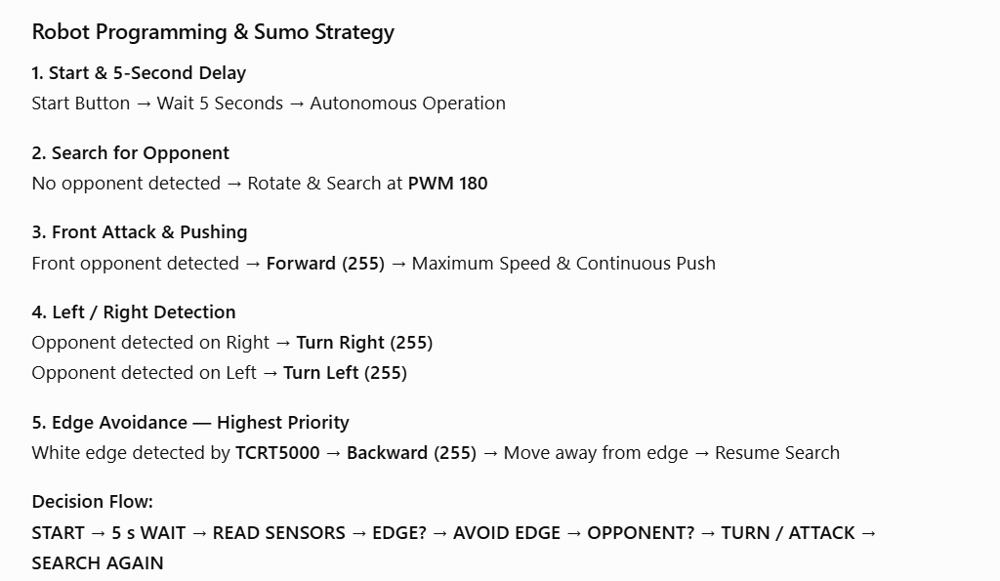

### 1. Start & 5-Second Delay

The robot is activated using a physical start button.

After activation:

**Start Button → Wait 5 Seconds → Autonomous Operation**

The robot does not begin autonomous movement until the required 5-second delay is completed.

### 2. Search for Opponent

When no opponent is detected, the robot rotates and searches around the ring.

The search movement uses controlled motor speed, allowing the sensors to scan the surrounding area for an opponent.

### 3. Opponent Detection

The E18 sensors monitor different directions.

When an opponent is detected:

- **Front detection → Direct attack**
- **Right detection → Turn toward the right**
- **Left detection → Turn toward the left**

This allows the robot to change its direction according to the detected position of the opponent.

### 4. Attack & Continuous Push

When the opponent is detected in front of the robot, both sides of the drive system move forward at maximum programmed attack power.

**Attack PWM = 255**

The robot continues pushing while the opponent remains detected.

### 5. Edge Avoidance – Highest Priority

Protecting the robot from leaving the ring has priority over attacking.

When either TCRT5000 sensor detects the white edge:

**White Edge Detected → Move Backward → Move Away from Edge → Resume Search**

This allows the robot to interrupt an attack when necessary, avoid falling outside the ring, and return to searching for another opponent.

### Main Decision Flow

**START → 5-SECOND WAIT → READ SENSORS → CHECK EDGE → SEARCH → DETECT OPPONENT → TURN / ATTACK → PUSH → SEARCH AGAIN**

---

## 🏎️ Competition Strategy

The robot's competition strategy focuses on three main areas.

### Speed & Pushing

High motor power is used during attack to increase pushing performance.

When the opponent is directly in front of the robot, the motors use maximum programmed attack power to support continuous pushing.

### Search & Maneuvering

When the opponent is not directly detected, the robot searches the ring.

The right and left opponent sensors help the robot determine which direction to turn before attacking.

### Edge Avoidance

The TCRT5000 sensors continuously monitor the ring boundary.

Edge detection has priority over the attack strategy so the robot can interrupt other actions, move away from the white boundary, and then resume searching.

---

## 🛠️ Engineering Design

The robot was designed using **Fusion 360** before final assembly.

The engineering design helped us:

- Plan the chassis structure
- Determine component positions
- Arrange the motors and wheels
- Plan sensor positions
- Maintain balanced movement
- Keep the front wedge low for effective pushing
- Keep the electronics accessible for modification and maintenance
- Maintain the required competition dimensions and weight

### Design Considerations

During the engineering design process, we considered:

- Maximum robot dimensions of **20 × 20 cm**
- Maximum robot weight of **2.5 kg**
- Balanced motor and wheel placement
- Clear fields of view for the front and side sensors
- A low front wedge to support effective pushing
- Safe placement of electronic components
- Accessibility for maintenance and modifications
- Sensor positions that support opponent detection and edge avoidance

The digital design was compared with the physical robot during assembly to make sure that the components and structure matched the planned design.

---

## 📐 CAD Design

The engineering design was created using **Fusion 360**.

Four CAD views are included in this repository to document the robot design from different directions.

### Front Left View

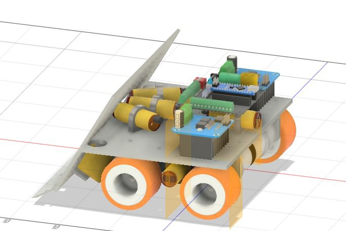

### Front Right View

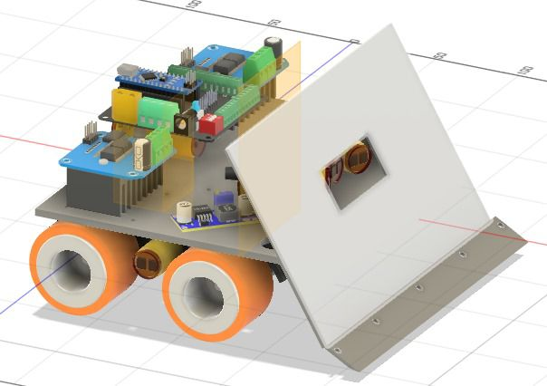

### Rear View

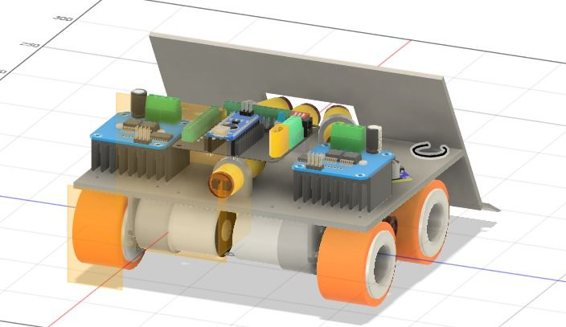

### Side View

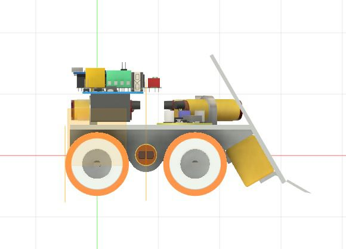

### CAD Files in this Repository

- [`CAD-Front-Left-View.jpg`](CAD-Front-Left-View.jpg)
- [`CAD-Front-Right-View.jpg`](CAD-Front-Right-View.jpg)
- [`CAD-Rear-View.jpg`](CAD-Rear-View.jpg)
- [`CAD-Side-View.jpg`](CAD-Side-View.jpg)

---

## 🧩 Complete STEP Design File

The complete engineering design was saved from **Fusion 360** in STEP format.

The STEP design was used to review the chassis structure and component positions before and during robot assembly.

The complete STEP file is too large to upload directly to this GitHub repository, so it is provided through Google Drive.

### 🔗 [View / Download Robot STEP Design File](https://drive.google.com/drive/folders/1NF3Zi0hPWuYoLqsQZxb4kRwaoPk6AhV0?usp=drive_link)

The four CAD images included in this repository provide additional visual documentation of the engineering design.

---

## 🖨️ 3D Printing

3D printing was used during the development process to manufacture selected robot body parts from the digital design.

The printed parts were checked and tested before being used in the robot.

The 3D printing process is documented in our video documentation section below.

---

## 🇸🇦 Heritage-Inspired Design

After developing the engineering structure, we created an exterior design inspired by **Saudi heritage**.

The final exterior transforms the robot into a heritage-style vintage pickup while maintaining the robot's engineering structure, movement, and sensor operation.

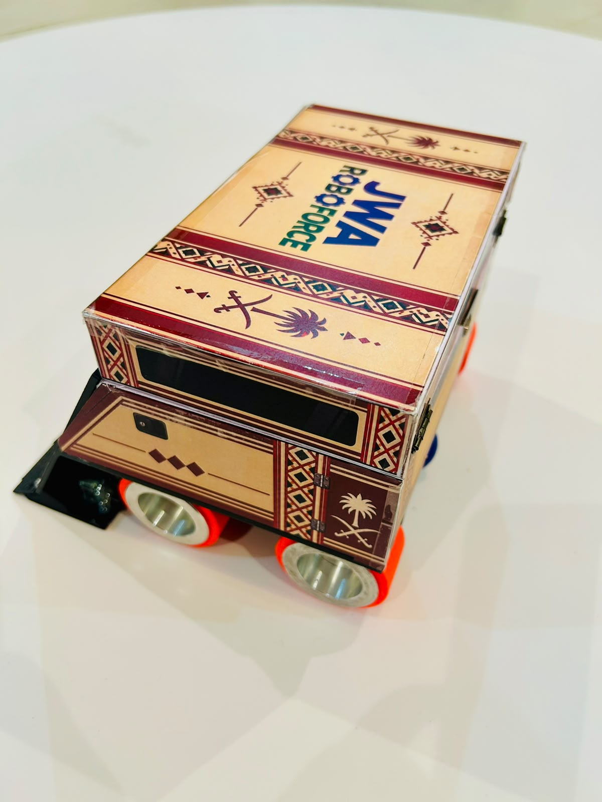

### Heritage Design Panels

The exterior panels were designed according to the physical dimensions of the robot before printing and installation.

The heritage design includes:

- Side Panel
- Rear Panel
- Front Panel
- Windshield Panel
- Top Panel

The dimensions of each piece were checked to fit the physical robot.

The panels use visual elements inspired by Saudi heritage while fitting around the engineering structure and sensor positions.

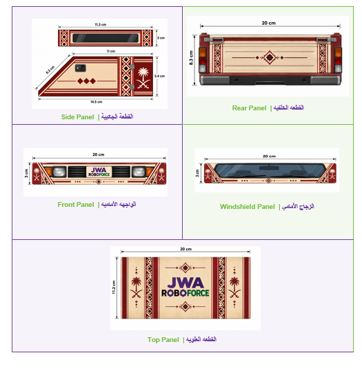

---

## 🧪 Testing & Improvement

The robot was tested repeatedly throughout the development process.

Testing focused on:

- Motor movement
- Motor speed
- Search behavior
- Opponent detection
- Front attack
- Left and right detection
- Continuous pushing
- Pushing power
- Edge detection
- Fall prevention
- Returning to search after edge avoidance
- Sensor positioning
- Robot stability

After each test, we observed the robot's behavior and adjusted the programming, sensor positions, movement, or structure when needed.

This iterative engineering process helped us improve the robot before reaching the final design.

---

## 📸 Robot Engineering Photos

The following photographs document the robot's structure, sensors, electronics, mechanical design, and final appearance.

### Final Front View

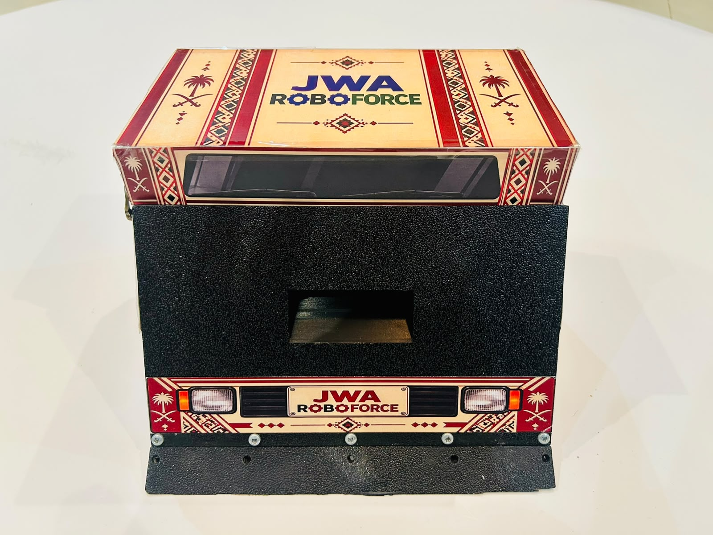

### Chassis Side View

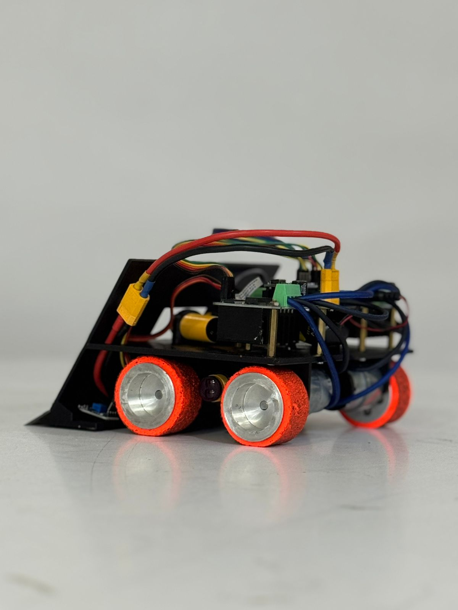

### Front Wedge & Sensors

### Electronics Top View

### Internal Components

### Heritage Final Design

---

## 🎥 Video Documentation

Our video documentation presents the development, design, testing, and performance of the **JWA RoboForce WRO 2026 Sumo Robot**.

The videos demonstrate both the technical performance of the robot and its heritage-inspired exterior design.

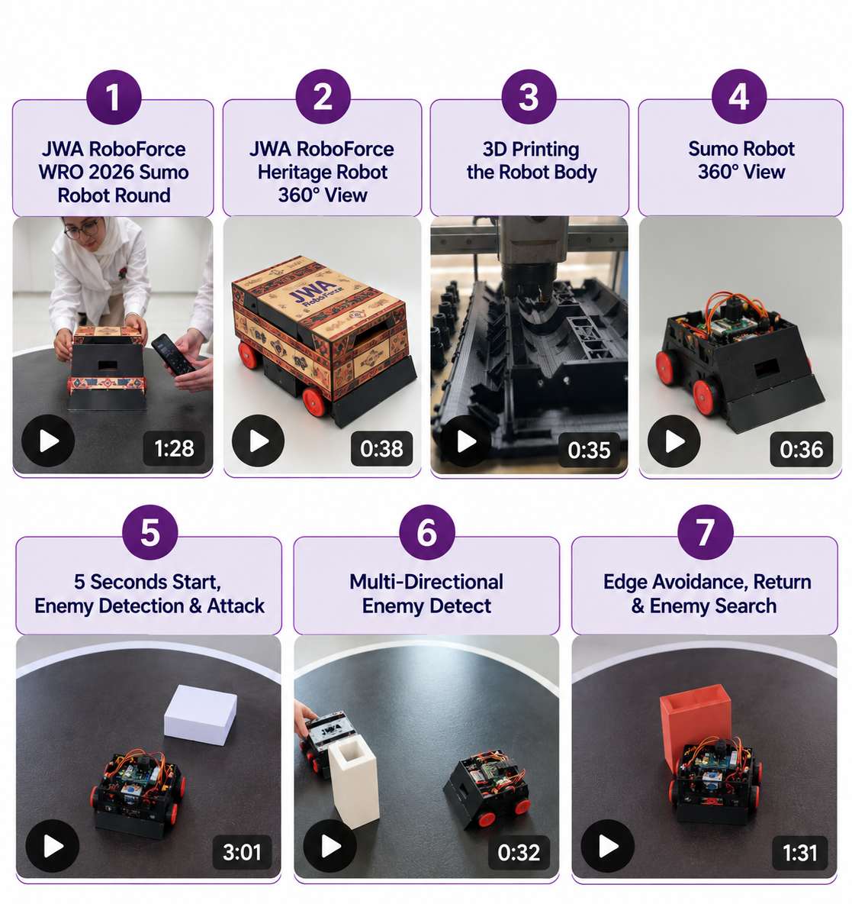

---

### ▶️ Full Playlist

The complete playlist contains the seven videos documenting our robot.

### [▶️ JWA RoboForce – WRO 2026 Sumo Robot | Full Playlist](https://youtube.com/playlist?list=PLaqB6dWrmZgQ)

---

### 1. JWA RoboForce WRO 2026 Sumo Robot Round

This video presents the robot's main Sumo round and demonstrates its autonomous performance.

### [▶️ Watch Sumo Robot Round](https://youtu.be/V3TKZraFOD4)

---

### 2. JWA RoboForce Heritage Robot 360° View

This video presents a 360° view of our completed Sumo robot, showing the robot from all sides and its final exterior design inspired by Saudi heritage.

### [▶️ Watch Heritage Robot 360° View](https://youtu.be/fAYnZk6bUvM)

---

### 3. 3D Printing the Robot Body

This video documents the 3D printing process used during the development of the robot body.

### [▶️ Watch 3D Printing the Robot Body](https://youtu.be/2AUK15_T78U)

---

### 4. Sumo Robot 360° View

This video provides a 360° view of the Sumo robot, showing its overall structure and engineering design from different sides.

### [▶️ Watch Sumo Robot 360° View](https://youtu.be/qLLj00ID7Eg)

---

### 5. 5-Second Start, Enemy Detection & Attack

This video demonstrates the physical start button, required 5-second delay, autonomous opponent detection, and attack strategy.

### [▶️ Watch 5-Second Start, Enemy Detection & Attack](https://youtu.be/Yr910-EBNpw)

---

### 6. Multi-Directional Enemy Detection

This video demonstrates how the robot uses its opponent sensors to detect the opponent from different directions and respond by changing its direction.

### [▶️ Watch Multi-Directional Enemy Detection](https://youtu.be/izRPt1SDrLM)

---

### 7. Edge Avoidance, Return & Enemy Search

This video demonstrates edge detection, fall prevention, movement away from the ring boundary, and the robot's return to its opponent-searching strategy.

### [▶️ Watch Edge Avoidance, Return & Enemy Search](https://youtu.be/8yNX0cuLgnM)

---

## 👩‍🎓 Team & Final Robot

The project was completed through teamwork between the students and their coach throughout the design, building, programming, testing, and improvement stages.

### Team with Robot

### Team with Coach and Final Robot

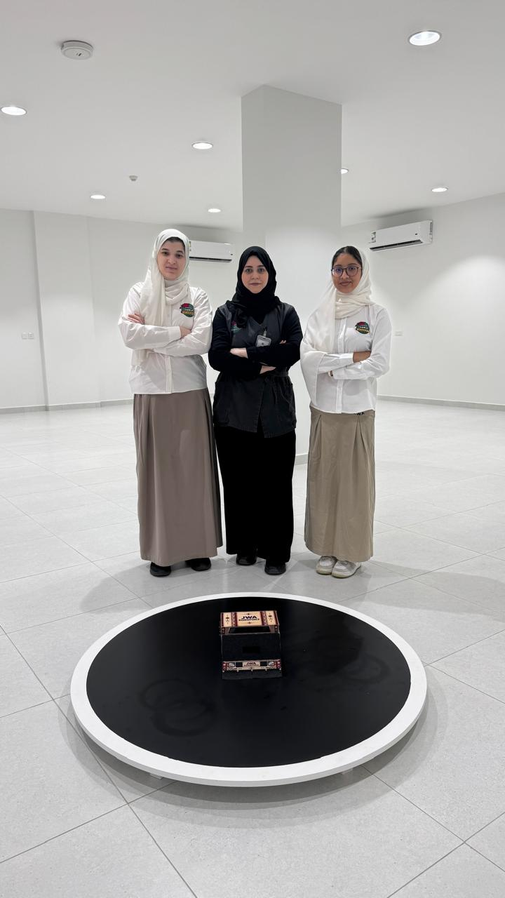

---

## 📂 Repository Contents

This repository contains the main engineering documentation for the JWA RoboForce WRO 2026 Sumo Robot.

### Programming

- `RoboSumo_code.ino`

### Engineering Design

- `CAD-Front-Left-View.jpg`
- `CAD-Front-Right-View.jpg`
- `CAD-Rear-View.jpg`
- `CAD-Side-View.jpg`

### Robot Engineering Photos

- `Robot-Chassis-Side-View.jpg`
- `Robot-Electronics-Top-View.jpg`
- `Robot-Final-Front-View.jpeg`
- `Robot-Front-Wedge-and-Sensors.jpg`
- `Robot-Internal-Components.jpeg`

### Components & Strategy

- `Robot-Main-Components.png`
- `Robot-Programming-and-Attack-Strategy.png`

### Heritage Design

- `Robot-Heritage-Design.jpeg`
- `Robot-Heritage-Design-Panels.png`

### Video Documentation

- `Video-Documentation.jpg.png`

### Team Documentation

- `JWA-RoboForce-Team.png`
- `Team-with-Coach-and-Final-Robot.jpeg`

### External Engineering File

- Complete Fusion 360 STEP design file available through the Google Drive link provided in the **Complete STEP Design File** section.

---

## 🔄 Engineering Process

Our development process followed an iterative engineering approach:

**Design → Build → Program → Test → Observe → Improve → Test Again**

Throughout the project, we tested different solutions, observed the robot's behavior, modified the design and programming, and repeated the tests until we reached our final robot.

---

## 🏁 Final Result

The final JWA RoboForce Sumo Robot combines:

- Autonomous Arduino control
- Multi-directional opponent detection
- Edge detection and fall prevention
- High-speed attack and continuous pushing
- Search and maneuvering strategies
- Fusion 360 engineering design
- 3D printed components
- Saudi heritage-inspired exterior design
- Structured engineering and video documentation

The final robot represents the complete development process of **JWA RoboForce** for the **WRO 2026 Sumo Robot Competition**.

---

# 🤖 JWA RoboForce

**Jeddah World Academy**  
**WRO 2026 – Sumo Robot**  
**Team No. 5902**

**Students:** Ghazl Bakhsh & Layan Baroom  
**Coach:** Samah AbuAbsah
